# yt-dlp.cmd

A batch (cmd) file made to simplify the usage of yt-dlp on Windows.

- Supports drag and droping for .url files and text files with links (one per line).
- Can download a link from clipboard with default preset (change it for your needs).
- Offers many built-in presets for Audio and Video (all is optional).
- And more...

## yt-dlp_nest_comments_fork.py and yt-dlp_nest_comments_new.py
Python scripts by [many](https://gist.github.com/tinyapps/df2b6757a142ff93caf9c63d0ef38b11) authors to prettify downloaded comments and make them readable.

## sed.commands
Text file with sed commands needed to make subtitles more readable.

## Requirements
-  [FFmpeg](https://github.com/MartinEesmaa/FFmpeg-Builds) - to merge video and audio files (and a lot more). A static nonfree build version with audiotoolbox (not gpl,lgpl).
-  sed, tr, grep, head - Linux/Unix utils ported to Windows. [Included](https://github.com/git-for-windows/git) in git for Windows (you may choose PortableGit.7z variant in releases).
-  [moreutils-go](https://github.com/gabe565/moreutils-go) - because of 'ts' linux utility. Used for generating timestamps in standard input/output.
-  aria2c (optional) - to use as external downloader if needed. Choose version from [SourceForge](https://sourceforge.net/projects/aria2.mirror/) to avoid certificate files problem on Windows.  
-  [paste](https://gist.github.com/jpflouret/19da43372e643352a1bf) - to pipe contents of Windows clipboard. Download [here](https://gist.github.com/jpflouret/19da43372e643352a1bf#file-paste-zip).
-  [Python](https://www.python.org/downloads/windows/) - to run .py scripts (if need to download readable comments).

Fill-in the settings in yt-dlp.cmd (example).

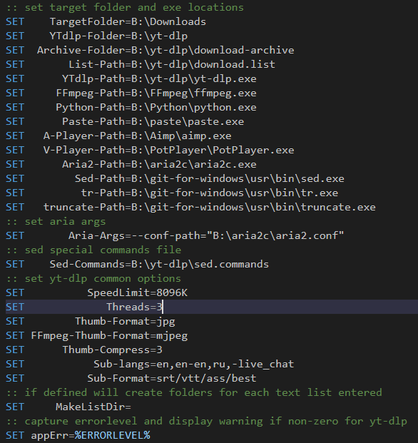

### Used and Recommended yt-dlp plugins
- [yt-dlp-ReturnYoutubeDislike](https://github.com/pukkandan/yt-dlp-returnyoutubedislike) - A postprocessor plugin for Return YouTube Dislikes.
- [yt-autosub-srt-fix](https://github.com/jgoguen/srt_fix) - A plugin to fix double lines of YouTube subtitles.
- [yt-dlp-YTCustomChapters](https://github.com/bashonly/yt-dlp-YTCustomChapters) - Extractor plugin for using custom YouTube chapter lists.
- [yt-dlp-split-and-tag](https://github.com/danilovsergei/yt-dlp-split-and-tag) - Helps tagging splitted chapters. Or not. Maybe better to use TagScanner. 
  - Add these line at the top of "split_and_tag.py" to fix encoding errors with tee:
    ```
    import sys
    import io
    sys.stdout = io.TextIOWrapper(sys.stdout.buffer, encoding='utf-8')
    sys.stderr = io.TextIOWrapper(sys.stderr.buffer, encoding='utf-8')
	```
- [yt-dlp-getpot-jsi](https://github.com/grqz/yt-dlp-getpot-jsi) - A plugin that attempts to generate POT. Provides some more [formats](https://github.com/yt-dlp/yt-dlp/wiki/PO-Token-Guide#current-po-token-enforcement) to choose from.
- [Yandex.Translate](https://github.com/gnfalex/YT_yt_dlp_plugin) - yt-dlp plugin to download automatic audio translation from Yandex Translate, based on voice-over-translation and vot-cli.
- [yt-dlp-replaygain](https://github.com/Eboreg/yt-dlp-replaygain) - Postprocessor plugin for audio volume normalization.
  - [rsgain](https://github.com/complexlogic/rsgain)
  - [AACGain](https://www.rarewares.org/aac-encoders.php#aacgain)
  - [VorbisGain](https://www.rarewares.org/ogg-tools.php#vorbisgain)
  - [MP3Gain](https://mp3gain.sourceforge.net/download.php)

## Screenshots (new)

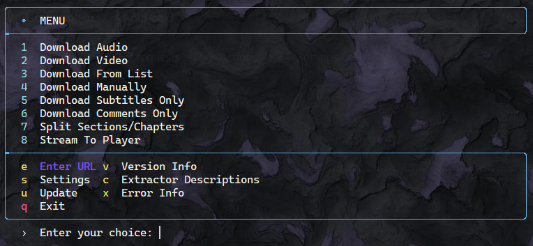  

## Screenshots (old)

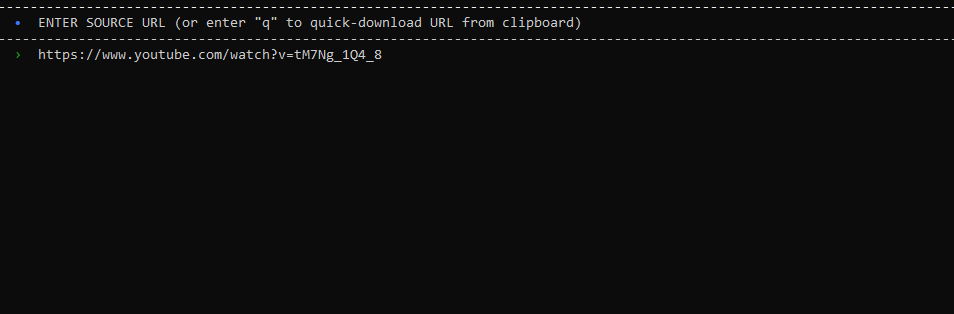  
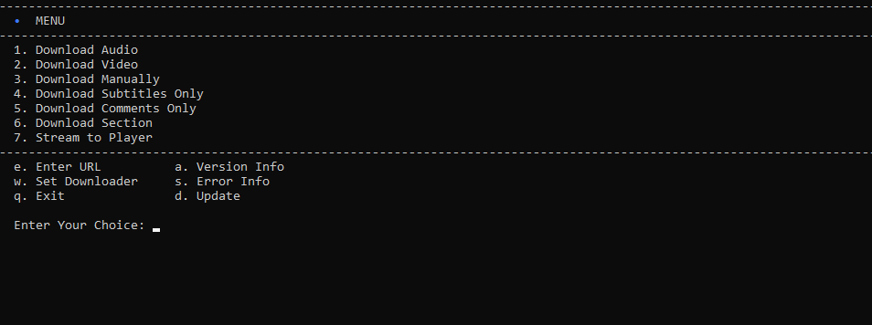  
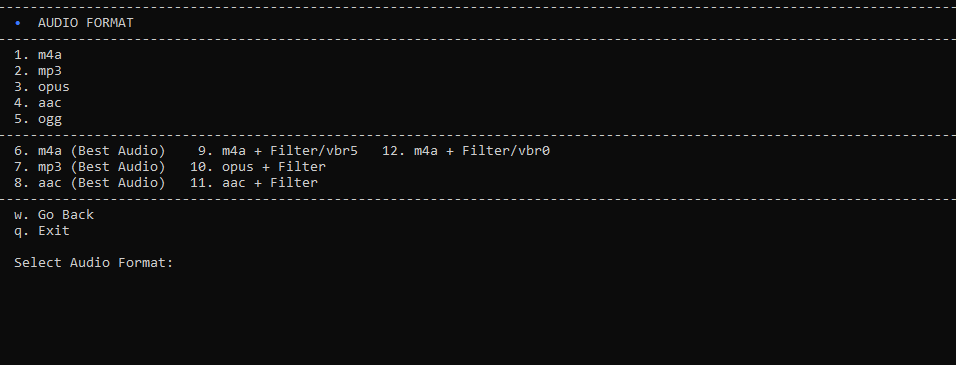  
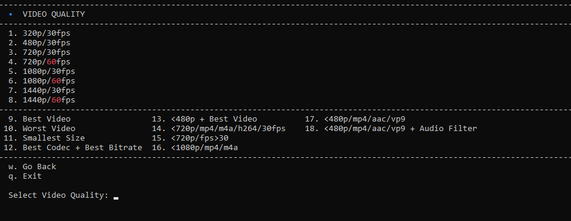  
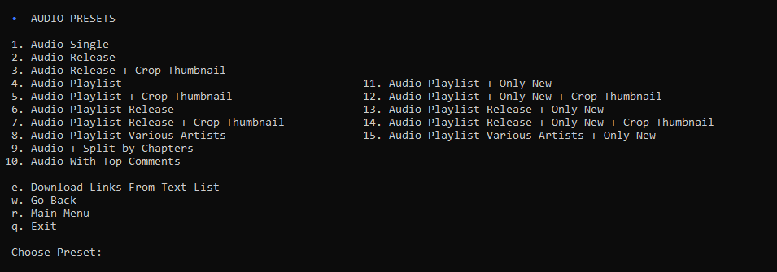  
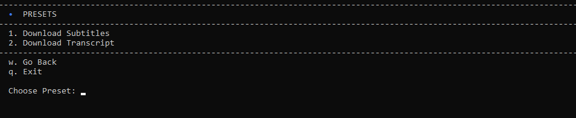  
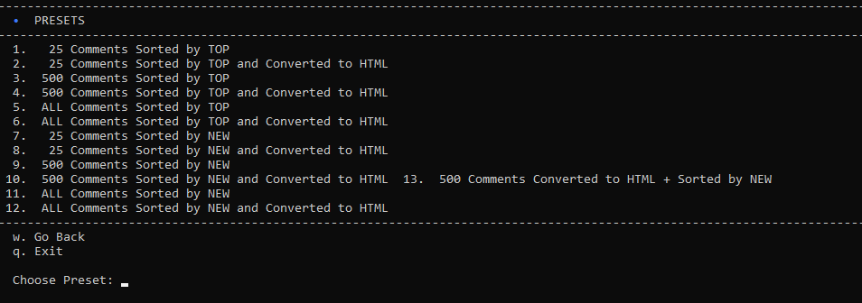  
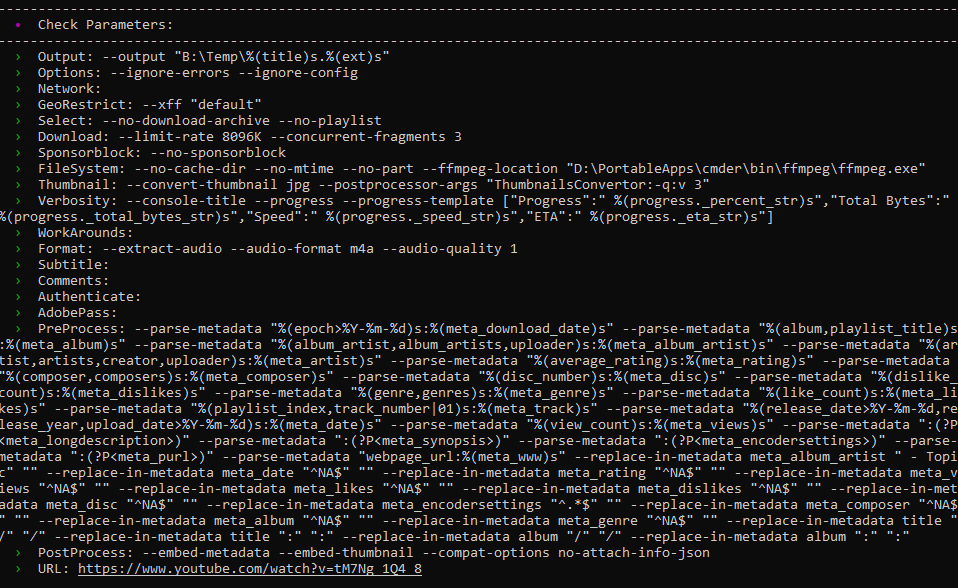  
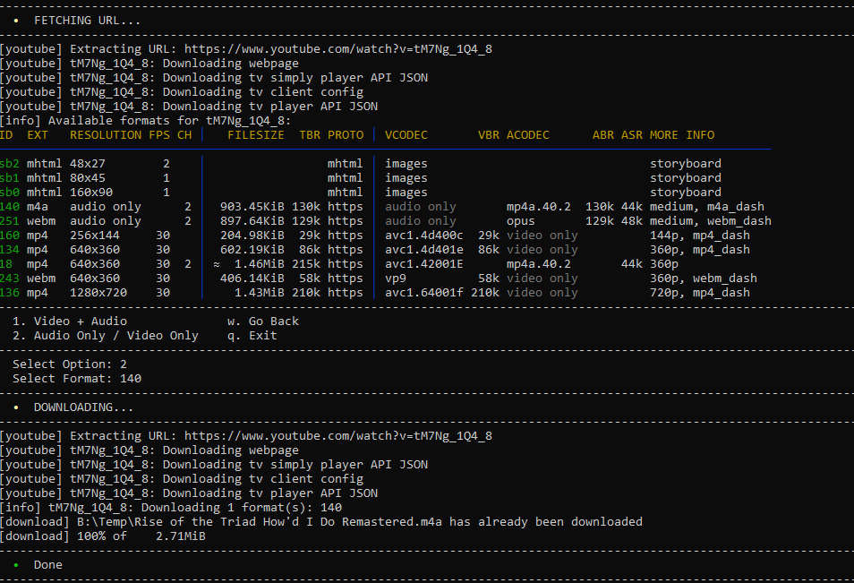  

## Contribute
Feel free to fork and contribute if you wish.
Examples of the correct syntax for using 'parallel' in Windows are desirable.
Examples of how to disable the command history for this script are desirable (so as not to clutter up the Windows command history with letters and numbers '2', '1', 'w', etc.).
Suggestions for good presets are welcome.

## Questions

**- Can you code?**  
_- No_.  
**- Do you know batch?**  
_- No_.  
